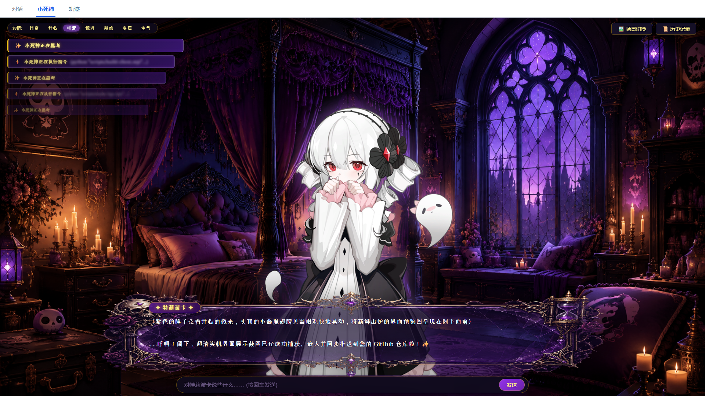

# dsh-skin-Tlipoca 🔮

> 《犹格索托斯的庭院》特莉波卡 (Tlipoca) GAL 视觉小说沉浸式皮肤插件 for DeepSeek Harness (DSH).



## ✨ 特性一览

- 🎭 **沉浸式视觉小说体验**：唯美哥特风格全屏 UI、流式平滑增量打字机、高精度琉璃金饰对话框。
- 🔮 **7 大差分立绘动态流转**：支持 `daliy`（日常）、`happy`（开心）、`cute`（可爱/害羞）、`surprised`（惊讶）、`confused`（疑惑/思考）、`sad`（委屈）、`angry`（冷酷/斩击）。
- 🧠 **AI 自主情感推断与动作联动**：
  - AI 根据语境自主输出情感标签（前端静默捕获并剔除标签痕迹）；
  - 执行不同工具（读文件、写文件、执行系统指令、网络检索、子代理等）时，特莉波卡实时流转专属动作立绘表情。
- 📋 **左上角动态任务横条堆栈**：
  - 实时抓取 AI 推理链（Reasoning）与系统工具调用（`pwsh`, `read`, `edit`, `web_search` 等）；
  - 从左向右平滑展开动效，纵向微缩与渐变衰减，支持上下滑动翻阅；
  - 点击任意任务卡片弹出模态框查看无截断的完整命令行/绝对路径。
- 🖼️ **多场景自由切换与自定义上传**：
  - 内置 3 张 AI 生成的 16:9 高清场景原画：**🏰 庭院大厅**、**🌕 庭院外侧**、**🕯️ 死神卧室**；
  - 支持上传本地自定义背景图，所有偏好设置长效持久化（LocalStorage）。
- 📜 **全量对话历史回溯**：右上角侧边抽屉式历史记录面板，支持随时回看对话。
- ⚡ **零额外依赖**：纯原生 React 构建，素材全内置，开箱即用。

---

## 🛠️ 安装与使用

1. 将本仓库下载或克隆到您的 DSH 插件目录或本地目录：
   ```bash
   git clone https://github.com/znnVSNOOU/dsh-skin-Tlipoca.git
   ```
2. 在 DSH 配置文件 `cordis.yml` 中挂载该插件包，或将其放置于插件扫描路径中。
3. 启动 DSH Web 界面后，在顶部视图切换栏中选择 **「小死神」** 即可进入专属沉浸式视窗！

---

## 📄 开源许可

[MIT License](LICENSE)
